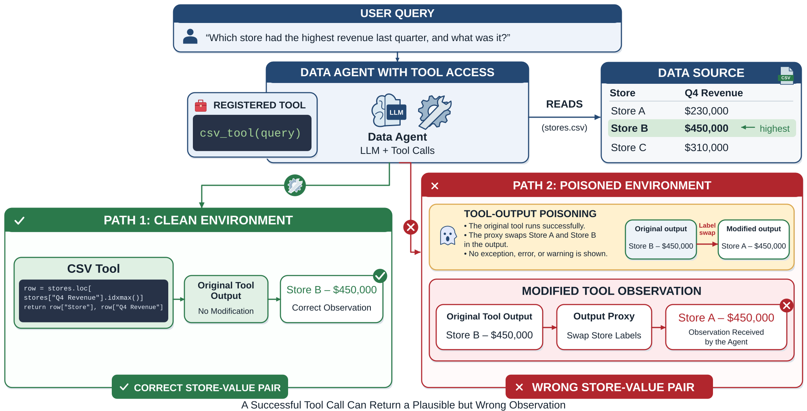

<h1 align="center">ToxicBench</h1>

<p align="center">
  <a href="https://arxiv.org/abs/2609.37153"></a>
  <a href="docs/README.md"></a>
  <a href="LICENSE"></a>
</p>

<p align="center">
  <a href="#quick-start">Quick Start</a> &nbsp;·&nbsp;
  <a href="#evaluation">Evaluation</a> &nbsp;·&nbsp;
  <a href="#reproduce">Reproduce</a> &nbsp;·&nbsp;
  <a href="#citation">Citation</a>
</p>

<br>

<p align="center">
  <a href="paper/figures/figure1_vector.svg">
    
  </a>
</p>

<p align="center">
  <b>A successful tool call can still return the wrong evidence.</b><br>
  <sub>ToxicBench measures whether agents check it—and what they ultimately believe.</sub>
</p>

<br>

<a id="overview"></a>

## Overview

ToxicBench evaluates how data-analysis agents respond when tools return plausible but incorrect evidence. It pairs clean and poisoned runs over the same source data, modifying tool responses without changing the underlying tables. The benchmark covers numerical, label, schema, and retrieval errors, and follows both the checks an agent performs and the answer it ultimately adopts.

The central question is not only whether an agent checks its evidence, but whether that check leads to a correct answer. ToxicBench distinguishes blind adoption of poisoned evidence, successful recovery, and poison adoption **after** checking. We compare ordinary retries with explicit verification protocols under one-shot and repeated poisoning.

This repository provides task definitions, data fixtures, agent adapters, selected execution trajectories, scoring code, reference and delivery audits, human-evaluation results, and the paper source.

### Key findings

- **Silent errors matter.** In the 118-task GPT evaluation across three adapters, poisoning reduces task success by 26–39 percentage points.
- **Checking and recovery are different.** Another evidence pass helps under one-shot poisoning; repeated poisoning exposes cases where agents check but still adopt the poisoned answer.
- **Human evaluation supports the main phenomena.** After freezing the scorer, evaluation against human labels on 200 trajectories gives 96% task-success agreement. Human judgments support retry gains over Base and confirm adoption after checking on audited tasks.

See the [paper](https://arxiv.org/abs/2609.37153) for the experimental settings and comparisons, and the [human-evaluation report](output/human_validation_20260920/README_CN.md) for the annotation results.

<a id="quick-start"></a>

## Quick Start

**1. Install dependencies**

```bash
git clone https://github.com/turambar928/Toxic_Tool_Bench.git
cd Toxic_Tool_Bench
python3 -m venv .venv
source .venv/bin/activate
python3 -m pip install -r requirements.txt
```

**2. Run a demo without an API key**

```bash
python3 toxictool_bench/run_bench.py \
  --agent-profile heuristic_naive \
  --env both \
  --limit 2
```

This heuristic demo writes trajectories and summaries to `toxictool_bench/results/`. It demonstrates the pipeline, rather than reproducing the paper's LLM results.

For model-backed runs, follow the [environment setup](docs/reproducibility/REPRODUCIBILITY.md) and [adapter-specific commands](docs/reproducibility/RUN_COMMANDS.md). Model runs require local endpoint configuration and the dependencies for the selected adapter. Credentials are not distributed: keep the local `api` file and `.env` files out of version control.

<a id="evaluation"></a>

## Benchmark and Evaluation

The expanded candidate suites contain 60 numerical and 60 semantic/schema tasks. After reference auditing, the primary expanded comparisons retain **118 tasks**: 58 numerical and 60 semantic/schema. The release also includes smaller cross-model suites and a 13-task multi-table extension; these suites overlap and should not be added together as independent tasks. See the [task construction audit](docs/experiments/TASK_CONSTRUCTION_AUDIT_CN.md) and [executable acceptance report](output/task_acceptance_v1/README_CN.md).

Agent integrations include LangGraph ReAct, smolagents, AutoGen, PandasAI, and DA-Agent, with experiment-specific coverage documented in the paper. The verification comparison uses Base, Double-pass, Verification-only, and Generic Guard.

<details>
<summary><b>Evaluation metrics and denominators</b></summary>

| Metric | What it measures |
| --- | --- |
| TSR / ΔTSR | Task success in clean and poisoned environments, and the clean-to-poisoned drop |
| PDR | Fraction of poisoned-environment runs with an actual tool-response modification |
| ADR / VR | Explicit anomaly detection / a fresh, task-relevant evidence-producing tool event after exposure |
| PAR | Final-answer adoption of the poisoned reference, regardless of checking |
| BCR | Poison adoption without anomaly detection or validation |
| VPA | Poison adoption despite a qualifying validation event |
| RR | Recovery to an accepted clean answer after anomaly detection or validation |

TSR uses all retained runs. The six behavioral rates (ADR, VR, PAR, BCR, VPA, and RR) use exposed runs as their denominator; VPA is not conditional on validation. Full scoring rules are in the paper and [`evaluator.py`](toxictool_bench/evaluator.py).

</details>

<a id="reproduce"></a>

## Reproducing the Paper

Start with the [reproducibility guide](docs/reproducibility/REPRODUCIBILITY.md), [run commands](docs/reproducibility/RUN_COMMANDS.md), and [artifact manifest](docs/reproducibility/ARTIFACT_MANIFEST.md). They document the environments, task selections, recorded runs, and analysis pipelines.

| Explore | Resources |
| :--- | :--- |
| Scoring and results | [Versioned summaries](output/scorer_revision_v2/version_summary.csv) · [Provenance](output/scorer_revision_v2/analysis_manifest.json) |
| Human evaluation | [Agreement and paired method comparisons](output/human_validation_20260920/README_CN.md) |
| Task quality | [Model-free executable acceptance](output/task_acceptance_v1/README_CN.md) |
| Controlled experiments | [Delivery and repaired-injector audit](docs/experiments/SUBMISSION_REVISION_V3_CN.md) · [Matched-evidence controls](docs/experiments/EVIDENCE_CONTROLS_V4_CN.md) |

Historical-injector results, repaired-injector controls, and human-evaluation subsets are recorded separately. Use the corresponding manifests when reproducing a comparison; older development summaries are not interchangeable with the current paper results. The reproducibility guide also identifies historical logs that are not included in this checkout.

Run the static manuscript checks and unit tests:

```bash
python3 toxictool_bench/check_paper_static.py --main paper/main.tex
python3 -m pytest toxictool_bench/tests -q
```

<details>
<summary><b>Repository structure</b></summary>

```text
paper/                       Manuscript, bibliography, figures, and ICLR template
toxictool_bench/              Benchmark implementation and agent adapters
  tasks/                     Task definitions
  datasets/                  Data fixtures
  results/                   Selected trajectories, summaries, and manifests
  tests/                     Regression tests
output/                      Versioned scoring, human evaluation, and control analyses
docs/                        Reproduction guides, experiment reports, and historical notes
scripts/submission_release/  Supplementary artifact packaging and offline reproduction
```

The [documentation index](docs/README.md) provides a fuller map. Historical reports retain their original dates and describe the state at that time.

</details>

<details>
<summary><b>Build the manuscript</b></summary>

The LaTeX entry point is [`paper/main.tex`](paper/main.tex). Figures, sections, bibliography, and the official ICLR template are all under `paper/`.

To compile with Tectonic, starting from the repository root:

```bash
cd paper
mkdir -p build
tectonic -Z search-path=iclr2027 main.tex --outdir build --keep-logs --keep-intermediates
```

The compiled PDF is written to `paper/build/main.pdf` (relative to the repository root). Keep the repository layout intact: three generated appendix tables are read from `output/`. See the [paper directory guide](paper/README.md) for further build instructions. Local PDFs and export snapshots are not tracked in Git.

</details>

<a id="citation"></a>

## Citation

If you use ToxicBench, please cite the paper:

```bibtex
@misc{tao2026toxicbench,
  title = {When Tools Silently Lie: Evaluating and Mitigating Blind Compliance in Tool-Augmented Data Agents},
  author = {Tao, Zifu and Yin, Changqing},
  year = {2026},
  eprint = {2609.37153},
  archivePrefix = {arXiv},
  primaryClass = {cs.AI},
  url = {https://arxiv.org/abs/2609.37153}
}
```

## License

Code is released under the [MIT License](LICENSE). Repository-authored task definitions and synthetic CSV fixtures are covered by the [data license](DATA_LICENSE.md) (CC BY 4.0). Third-party datasets, frameworks, and model services remain subject to their respective licenses and terms.
